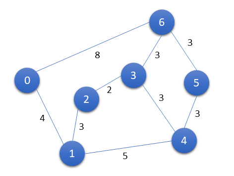
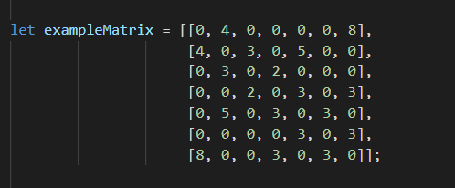
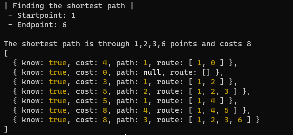

# Dijkstra's algorithm
Written in javascript (designed for use with nodejs or browser)

## Usage example 

Simple example undirected graph. Blue dots are nodes (or vertices), lines are links (or edges) and every link has cost (or weight).

Now the graph has to be converted to distance matrix. This matrix array can be then send to the function as one of the arguments. Function other arguments are startpoint node index number, endpoint node index number and boolean for showing running time logs from the function.

 

Function return data, when used the example matrix array. Console log shows the shortests path from node 1 to node 6 and the actual returned object array. Array contains all the calculated shortests path from the startpoint node to all other nodes. Index numbers of the returned array corresponds to node number. 

